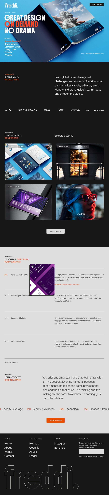

# freddi.design — Homepage Redesign Brief

**Date:** 2026-07-14
**Scope:** Homepage (`/`) section sequence + global nav, extended to `/pricing` and `/about`.
**Status:** Ready for implementation.

This brief is written against the live codebase (Next.js + Tailwind, `kloaq.css` design language). Every section below names the current component/file so implementation is a *modification*, not a rebuild, wherever an equivalent already exists.

### Reference mockup

The redesign direction below follows the shared mockup (source file: `website design/Main_v2.jpg`):



---

## 1. Design Tokens

### 1.1 Colour palette

Update the single source of truth in `styles/globals.css :root` (mirrored in `tailwind.config.ts` → `theme.extend.colors`). Do not hardcode hex anywhere else in the codebase — every rule should resolve through the CSS var or Tailwind class.

| Token | CSS var | Old value | **New value** | Notes |
|---|---|---|---|---|
| Black (ink) | `--black` | `#1E1E1D` | **`#171717`** | Base dark background / primary text-on-light. |
| Light Gray (was "cream") | `--off-white` | `#E7E7D6` | **`#DEDEDE`** | Renamed conceptually from a warm cream to a neutral light gray. Flows through `--cream` alias in `kloaq.css`, light-section backgrounds, and reversed (light-on-dark) text. |
| Orange (accent) | `--orange` | `#FF5900` | **`#F25623`** | The one accent — CTAs, active states, links, highlight text. |
| Orange (alpha channel) | `--orange-rgb` | `255, 89, 0` | **`242, 86, 35`** | Recompute from new orange; used for hairlines/glows at partial opacity. |
| Orange (pressed/hover) | `--orange-deep` | `#D94B00` | **`#CE491E`** (≈15% darker than `#F25623`) | CTA hover/press shade. |

Retire on this pass (dead tokens, no live usage found beyond declaration): `--slate` (`#ADA692`), `--yellow` (`#FF8C00`), `--light-orange` (`#FF6D00`). Safe to delete from both `globals.css` and `tailwind.config.ts`, or leave as unused legacy — flag to dev, not a functional blocker.

Retire entirely: `--gold` (`#C9A96E`, declared 3× in `kloaq.css`). Its only consumer is the footer wordmark's sunset gradient, which this brief removes (§4.6). Delete the token once the footer is updated.

**Semantic aliases** (`kloaq.css`, declared in 3 scoped `:root`-equivalent blocks — update all 3 together, or better, consolidate to reference `globals.css` directly):
```
--ink: var(--black);
--cream: var(--off-white);
```
These stay as-is; they'll pick up the new hex automatically once §1.1 lands.

### 1.2 Typography

**No new type scale required.** The existing system is a fluid `clamp()`-based ramp (`styles/globals.css :root`, mirrored in `tailwind.config.ts fontSize.tile`) that already scales continuously from 375px → 1440px. Keep it. Two families only:

| Role | Family | CSS var | Fallback stack |
|---|---|---|---|
| Display (headlines, hero voice, nouns, watermarks) | Boldonse | `--font-display` / `--display` | `'Anton', 'Sohne Breit', sans-serif` |
| Body / UI (nav, copy, labels, buttons) | Inter Tight | `--font-body` / `--body` | `'Sohne', sans-serif` |

Reference sizes already in the system (unchanged, for context):
- Hero voice / tile titles: `--type-tile: clamp(1.75rem, 4.6vw, 4.8rem)`
- Section padding rhythm: `--section-pad-y: clamp(88px, 11vw, 160px)`, `--section-pad-x: clamp(24px, 6vw, 80px)`

Flag any spot below where copy, weight, or hierarchy changes from what's currently shipped — those are called out per-section. Everything else inherits the existing scale untouched.

### 1.3 Radius / spacing

Unchanged: `14px` image radius (`--image` / `.borderRadius.image`), `12px` small variant. Section rhythm clamps (`--gap-lg/md/sm`) unchanged.

---

## 2. Global Navigation

**File:** `components/v2/KloaqNavbar.tsx` (+ nav rules in `styles/kloaq.css`)

Current layout: logo left, links + CTA right (`justify-content: space-between`).

**Changes:**
1. **Center the nav links.** Move `MENU_ITEMS` (About / Portfolio / Pricing) into a horizontally centered group, independent of the logo (left) and CTA (right). Target layout: `[logo] —— [About  Portfolio  Pricing] —— [CTA]`, three-zone flex/grid (`grid-template-columns: 1fr auto 1fr` or equivalent), not a single `space-between` row.
2. **CTA button colour.** "Let's Talk" button currently uses `var(--orange)` background with `var(--off-white)`/`var(--black)` text swap on hover — this now resolves to the new orange (`#F25623`) automatically via the token update in §1.1. No hardcoded hex to chase here (confirmed: `KloaqNavbar.tsx` already references `var(--orange)`, not a literal).
3. Mobile menu (full-page overlay) — no structural change requested; verify the accent wipe and CTA button pick up the new orange automatically.

---

## 3. Homepage — New Section Sequence

Update `app/page.tsx` to the new order. Current file imports/orders: `HeroStatementV4 → KloaqServices → [logos intro] → KloaqLogos → [about] → KloaqIndustries → KloaqCTA → KloaqFooter`.

**New order:**

1. Hero
2. Inside Freddi *(logo wall — optionally a marquee)*
3. Portfolio *(4 projects, new hover behaviour)*
4. What We Do
5. Manifesto *(combined with Industries marquee + CTA button)*
6. Footer *(redesigned, no gradient wordmark)*

### 3.1 Hero

**File:** `components/v4/HeroStatementV4.tsx` + `.v4-*` rules in `styles/kloaq.css` (~line 2750 onward)

Interactivity stays: hovering a service noun (Annual Reports, Investor Decks, Brand Identity, Campaigns, Packaging, Editorial) swaps the full-bleed background image to that project's hero shot. Three behaviour changes:

1. **Hover state: solid colour, not outline.** Currently `.v4-noun:hover .v4-noun-label` / `.is-active` sets `color: transparent; -webkit-text-stroke: 1.4px var(--orange);` (ghost/outline text, `kloaq.css` line ~2959). Replace with a solid colour change: `color: var(--orange);` (drop the `-webkit-text-stroke` and `transparent` fill). Keep the `.v4-noun-client` reveal (client name fade-up) as-is.
2. **Remove click-through navigation.** Currently `onClick={(e) => navigate(e, project)}` on each noun runs a shared-element transition into `/work/[slug]` (`HeroStatementV4.tsx`, the `navigate()` function + the `<a href="/work/${noun.slug}">` wrapper). Change nouns to non-navigating hover targets only:
   - Remove the `navigate` click handler (or make it a no-op / `e.preventDefault()` unconditionally).
   - Change the wrapping `<a href=...>` to a `<div>`/`<button type="button">` (or keep the `<a>` but strip `href` and add `role="link"`-free semantics) so there's no default browsing action and no visible affordance to click through.
   - Hover-driven background swap and the client-name reveal are unaffected — only the "click flies into the case page" behaviour goes away.
3. **New default (rest-state) backdrop: `bg-orange-grain.jpg`.** Currently `DEFAULT_SLUG` (`HeroStatementV4.tsx`) resolves to the first noun's project image (ANZ Annual Report) as the backdrop shown at load and on mouse-leave. Replace this with a dedicated static asset instead of a project photo: **`public/bg/bg-orange-grain.jpg`** (already in the repo). Changes needed:
   - Add a rest-state layer to `.v4-bg-stack` — either a base ``/CSS `background-image` sitting behind the six per-noun `.v4-bg` layers (visible whenever none of them is `.is-active`), or repurpose the existing cross-fade approach with `bg-orange-grain.jpg` as the true default and no noun `.is-active` on load/mouse-leave.
   - `active` state (`useState<string>`) should initialize to a sentinel (e.g. `null`/`"default"`) rather than `DEFAULT_SLUG` — a noun's project photo should only ever show while that specific noun is hovered, never at rest.
   - `onMouseLeave` should return `active` to that same default sentinel, not to the first noun's slug.
   - **Preload** `bg-orange-grain.jpg` (e.g. `<link rel="preload" as="image">` in `app/layout.tsx` head, or Next's `priority` prop if swapped to `next/image`) since it's the very first thing painted in the hero — no flash-in on load.

Everything else (scrim, entrance stagger, reduced-motion fallback, touch fallback) is unchanged.

### 3.2 Inside Freddi

**File:** currently inlined in `app/page.tsx` (the `.kloaq-logos-intro-section` block) + `components/v2/KloaqLogos.tsx`

Content unchanged: eyebrow "Inside Freddi," headline "Brands we've worked with," supporting paragraph, then the logo wall (ANZ, Digital Realty, Epson, LVMH, Lacoste, SK-II, Samsung, MBS).

**Marquee:** `KloaqLogos.tsx` is *already* a continuous scroll-linked marquee (auto-scrolling logo track, duplicated set for seamless loop) — no build needed, just confirm it's the section used here and that logo colour treatment (currently recoloured orange, per the component's own comment) picks up the new accent automatically.

### 3.3 Portfolio (new section — 4 projects)

**No direct homepage equivalent exists yet** — build new. Nearest reference patterns already in the codebase:

- `components/v2/KloaqCases.tsx` — the word-cloud portfolio on `/kloaq`, has cursor-trailing image reveal on hover (different pattern, for reference only).
- `components/v2/WorkIndex.tsx` — the `/work` grid index, closer structurally to a 2×2/4-tile grid.

**Spec:**
- 4 project tiles in a grid (per the reference mockup: 2×2 on desktop, stacking to 1-column on mobile per the existing breakpoint system — `lg: 1024px`).
- Each tile: project thumbnail image, category tag(s) shown at rest (e.g. "KEY VISUALS · CREATIVE DIRECTION", "BRAND IDENTITY", "KEY VISUALS · PITCH DECK" — pull from `lib/work.ts` project data, matching the tags pattern already used in `KloaqServices.tsx`).
- **Hover state:** image dims slightly (e.g. dark overlay `rgba(0,0,0,0.25–0.35)` or reduce `opacity`/`brightness()` filter — MOTION.md restricts animated properties to transform/opacity, so prefer an overlay `::after` fading `opacity: 0 → 1` over a `filter` animation) **and** zooms in (`transform: scale(1) → scale(1.05–1.08)` on the image inside an `overflow: hidden` frame — mirrors the `mask-scale` vocabulary already defined in `MOTION.md`). **Project title appears** on hover (fade-up, `opacity 0→1` + small `translateY`, consistent with the `fade-up` token in `MOTION.md`).
- Tap/coarse-pointer fallback: title + tags visible at rest (no hover-only content on touch), per the existing site-wide pattern of hover-affordance-degrades-to-always-visible on touch (see `HeroStatementV4`'s touch handling for precedent).
- CTA below grid: "View All Works →" linking to `/work`, styled per existing `.kloaq-whatido-link` pattern used elsewhere (e.g. `KloaqIndustries.tsx`, `KloaqAbout.tsx`).
- Section chrome: eyebrow label + heading pair (e.g. "[ Best of 2026 ]" / "Deep experience, six verticals" style eyebrow+H2, paired with a "Selected Works" side-heading per the reference layout) — follow the existing `.kloaq-vlabel` + `kloaq-whatido-heading` pattern for consistency with other sections.
- 14px image radius (`.borderRadius.image`) on all four tiles, matching the site-wide image treatment.

### 3.4 What We Do

**File:** `components/v2/KloaqServices.tsx` — reuse as-is, move up to position 4 in the sequence.

Content/behaviour unchanged: numbered rows (`01` Brand & Visual Identity, `02` Web Design & Development, `03` Campaign & Editorial, `04` Decks & Collateral), cursor-trailing image preview on hover (desktop), tap-accordion fallback (touch). No structural change requested — confirm colours inherit the new palette (they're already token-based, not hardcoded).

Note: closing link under this section currently reads "More about how we work →" pointing to `/about` in the flat About block — per the new sequence, this section's own link should point to `/pricing` ("See pricing & plans →", per the reference layout) since the standalone About block is removed from the homepage flow (About now lives only at `/about`, reachable from nav).

### 3.5 Manifesto + Industries + CTA (combined)

**Files:** merge `components/v2/KloaqIndustries.tsx` content into a new "Manifesto" framing, plus `components/v2/KloaqCTA.tsx`'s button.

Currently the homepage has: a flat 2-column "About" section (`app/page.tsx` inline block) → `KloaqIndustries` (marquee) → `KloaqCTA` (separate full CTA section with watermark) as three distinct sections/fields.

**New spec:** collapse into one section:
1. Eyebrow "[ Manifesto ]" + headline (repositioning current About copy as the studio manifesto — e.g. "Your dedicated design partner." as H2, followed by the existing paragraph: "You brief one small team and that team stays with it — no account layer, no handoffs between departments, no telephone game between the idea and the file that ships. The thinking and the making are the same two hands, so nothing gets lost in translation." — this is the existing `.kloaq-about-statement`/lead copy from the inline About block in `app/page.tsx`, relocated here, not rewritten).
2. Immediately below: the **Industries marquee** (`KloaqIndustries.tsx`'s auto-scrolling track — Food & Beverage, Beauty & Wellness, Technology, Finance & Banking, Retail & E-Commerce, Hospitality & Real Estate), same numbered-tag hover behaviour and floating preview image, unchanged.
3. **CTA button added** at the end of this combined section — pull just the button (not the full watermark treatment) from `KloaqCTA.tsx`, e.g. "Let's work together" in the new orange, using the existing `Magnetic` wrapper + `openBrief()` handler for consistency with the nav/mobile-menu CTA.

Net effect: the standalone full-bleed `KloaqCTA` section (with its large background watermark type) is folded into this combined block rather than existing as its own separate homepage field. If the watermark treatment is wanted for visual weight, it can stay as this section's background — flag to design for a call, not assumed here.

### 3.6 Footer

**File:** `components/v2/KloaqFooter.tsx` + `components/v2/KloaqFooterWordmark.tsx`

Structure unchanged: 4-column layout (Pages / Recent Works / Socials / Availability+contact), legal links row, big wordmark + back-to-top row at the bottom.

**Change — remove the gradient "sunset" treatment on the freddi wordmark:**
- `KloaqFooterWordmark.tsx` currently animates a per-character `background-image: linear-gradient(...)` cycling through a DAY→DUSK colour arc (cream → gold → orange stops, descending position) via `requestAnimationFrame`, clipped to text (`background-clip: text`).
- Replace with a **flat, static colour** — no animation, no gradient. Recommend the wordmark render in a single flat colour consistent with the rest of the footer's reversed (light-on-dark) treatment: either solid `var(--off-white)` (new light gray `#DEDEDE`) as a quiet ghost mark, or solid `var(--orange)` (new `#F25623`) if it should still read as an accent moment — designer's call, but it must be **one flat, non-animated fill**, not a gradient.
- This lets `KloaqFooterWordmark.tsx`'s entire rAF loop, `IntersectionObserver` gating, and the `DAY`/`DUSK`/`cycleProgress` logic be deleted — replace the component with a plain styled `<span>`/`<div>` rendering "freddi" in `--font-display`, or fold it directly into `KloaqFooter.tsx` and retire the file.
- Retire the `--gold` token (§1.1) once this lands — it has no other consumer.

---

## 4. Projects / Work Index Page (`/work`)

**File:** `components/v2/WorkIndex.tsx` (route: `app/work/page.tsx`)

This is the page the nav's "Portfolio" link and the new homepage Portfolio section's "View All Works →" button (§3.3) both point to — it needs to read as part of the same redesigned system, not the older look.

- **Apply new colour tokens (§1.1)** throughout — dark-field background, orange accents, meta text opacity values inherit automatically once tokens update.
- **Nav per §2** (centered links, updated CTA colour).
- **Hover treatment — match the Hero fix (§3.1).** `WorkIndex.tsx` uses the *same* outline/ghost pattern as the old hero nouns: `.work-index-row:hover .work-index-title` currently sets `color: transparent; -webkit-text-stroke: 1.5px var(--orange);` (`styles/kloaq.css`, ~line 2662). For consistency with the hero's new hover language, replace this with a **solid colour change** — `color: var(--orange);`, dropping the `transparent` fill and `-webkit-text-stroke` — so the whole site uses one hover vocabulary (solid accent colour on hover/active) instead of two (outline-ghost here, solid elsewhere). Leave the sibling-dim (`:has()` opacity 0.35 on non-hovered rows) and the cursor-trailing image preview (`.kloaq-thumb`) untouched — only the title's own colour transition changes.
- **Row click-through stays.** Unlike the hero (§3.1), this index page's *purpose* is navigation to each case — do not remove the click-to-`/work/[slug]` behaviour here.
- Align section chrome (eyebrow "[ Projects ]" label, heading, lead paragraph, image radius) with the visual language established across the redesigned homepage sections — already close; this is primarily a token + hover-consistency pass, not a structural rebuild.
- **Out of scope for this pass:** individual case-study pages (`/work/[slug]`, `components/v2/WorkDetail.tsx`) are not covered here — flag as a follow-up if they should pick up the same token/hover updates.

---

## 5. Pricing Page (`/pricing`)

**File:** `components/v2/KloaqPricing.tsx` (route: `app/pricing/page.tsx`)

Redesign to match the new homepage direction:
- Apply the new colour tokens (§1.1) — button/accent colours, light-section background (`var(--off-white)` → new `#DEDEDE`) inherit automatically once tokens update, but review contrast: the shift from a warm cream to a cooler, more neutral light gray may need a pass on the "featured" plan card's highlight treatment and any hairline/border opacity values tuned for the old cream.
- Bring the nav in line with §2 (centered links, updated CTA) — this page already flags itself as a light-background page (`onLightBg = pathname === "/pricing"` in `KloaqNavbar.tsx`), so double-check the nav's light/dark ink-swap logic still reads correctly against the new light gray.
- Align section rhythm/typography treatment (eyebrow labels, heading style, card layout) with the visual language established on the new homepage sections (§3) — same `.kloaq-vlabel` eyebrow pattern, same Boldonse/Inter Tight pairing, same 14px image radius on any imagery, same CTA button styling as the homepage's new combined Manifesto CTA (§3.5).
- Retainer plan content (Starter/Standard/Priority, hours, pricing, features) stays as-is — this is a visual/token pass, not a content or pricing-structure change.

## 6. About Page (`/about`)

**File:** `components/v2/KloaqAbout.tsx` (route: `app/about/page.tsx`)

Redesign to match the new homepage direction:
- Apply new colour tokens (§1.1) throughout.
- Nav per §2.
- Since the flat 2-column "About" copy block is being pulled *off* the homepage and relocated into the new Manifesto section (§3.5), review `/about` for duplication — this page's existing "Principles" grid (`01`–`04`: One voice start to finish / Fast without sloppy / Systems, not one-offs / One flat rate), the `STATS` row (10 years / 0 account managers / 48hr turnaround), and the static `INDUSTRIES` list should stay unique to this page rather than repeating the homepage's Manifesto paragraph verbatim.
- Align visual treatment (heading style, eyebrow labels, spacing rhythm, CTA styling) with the new homepage sections so `/about` reads as part of the same redesigned system, not the older Kloaq-only look.

---

## 7. Component / File Reference Map

| Section | Primary file(s) | Status |
|---|---|---|
| Colour tokens | `styles/globals.css`, `tailwind.config.ts`, `styles/kloaq.css` (3× scoped alias blocks) | Update |
| Navbar | `components/v2/KloaqNavbar.tsx` | Modify (centering) |
| Hero | `components/v4/HeroStatementV4.tsx`, `styles/kloaq.css` `.v4-*` | Modify (hover + click) |
| Inside Freddi | `app/page.tsx` (inline block), `components/v2/KloaqLogos.tsx` | Reuse, reorder |
| Portfolio (4 projects) | *new component*, reference `components/v2/WorkIndex.tsx` / `KloaqCases.tsx` | Build new |
| What We Do | `components/v2/KloaqServices.tsx` | Reuse, reorder, link target update |
| Manifesto + Industries + CTA | `components/v2/KloaqIndustries.tsx`, `components/v2/KloaqCTA.tsx`, `app/page.tsx` (inline About block copy) | Merge |
| Footer | `components/v2/KloaqFooter.tsx`, `components/v2/KloaqFooterWordmark.tsx` | Modify (remove gradient) |
| Homepage assembly | `app/page.tsx` | Reorder |
| Projects / Work index | `components/v2/WorkIndex.tsx` | Modify (tokens, nav, hover) |
| Pricing | `components/v2/KloaqPricing.tsx` | Redesign |
| About | `components/v2/KloaqAbout.tsx` | Redesign |

---

## 8. Open Items for Design/Dev Sign-off

1. **Manifesto+CTA watermark:** keep the large background watermark type from `KloaqCTA.tsx` in the combined section, or drop it now that CTA is folded in rather than standalone? (§3.5)
2. **Footer wordmark final colour:** flat light gray (quiet) vs. flat orange (accent) — needs a visual call. (§3.6)
3. **Portfolio section eyebrow/heading copy:** the reference mockup pairs "[ Best of 2026 ]" / "Deep experience, six verticals" with a "Selected Works" side-heading — confirm final copy, since "six verticals" duplicates language already used by the Industries block. (§3.3)
4. **Dead tokens** (`--slate`, `--yellow`, `--light-orange`, `--gold`): confirmed no live usage beyond declaration (`--gold` aside, retired in §3.6) — safe to delete on this pass, or leave for a separate cleanup. Not a blocker either way.
5. **Case-study detail pages** (`/work/[slug]`, `components/v2/WorkDetail.tsx`) are currently out of scope (§4) — confirm whether they should also pick up the new tokens and the solid-colour hover fix, since they likely share the same outline-ghost pattern.

---

## 9. Optional: Button Hover Micro-interaction ("roll" text)

**Status: optional / nice-to-have** — not required for this pass, current button hover treatment (colour swap, e.g. the nav CTA's background/text-colour flip) is an acceptable fallback if this isn't built.

Where a button currently just swaps colour on hover (nav "Let's Talk", homepage Manifesto CTA "Let's work together" (§3.5), "View All Works →" (§3.3), mobile menu CTA), the label text can optionally **roll** on hover instead of — or in addition to — the colour change: the current label slides out (e.g. `translateY(0% → -100%)`) while a duplicate copy of the label slides in from below (`translateY(100% → 0%)`), clipped inside `overflow: hidden`, so it reads as the word rolling upward and being replaced by itself.

**Suggested implementation** (fits the existing `MOTION.md` rules — transform/opacity only, no layout properties):
- Markup: two stacked `<span>` copies of the label inside an `overflow: hidden` wrapper (one visible at rest, one positioned `translateY(100%)` below it).
- On `:hover`/`:focus-visible`: both spans translate up by `-100%` together, so the rest-state copy exits the top while the duplicate enters from the bottom into the same slot.
- Timing: use the existing `dur-micro` token (`0.3s`) and `ease-out-luxe` (`cubic-bezier(0.16, 1, 0.3, 1)`) from `MOTION.md` §Tokens — hovers must resolve in ≤300ms per that doc's own rule, so this fits without adding a new token.
- Keep the colour swap that already exists as a second, simultaneous cue rather than replacing it — the roll adds motion, the colour still signals state.
- Reduced motion: per `MOTION.md`, hover feedback may remain but should degrade to opacity-only or the plain colour swap — skip the roll transform for `prefers-reduced-motion: reduce`.

This is a global button pattern, not section-specific — if adopted, apply it once (a shared `.btn-roll` utility/component) and reuse across every CTA listed above rather than reimplementing per button.
